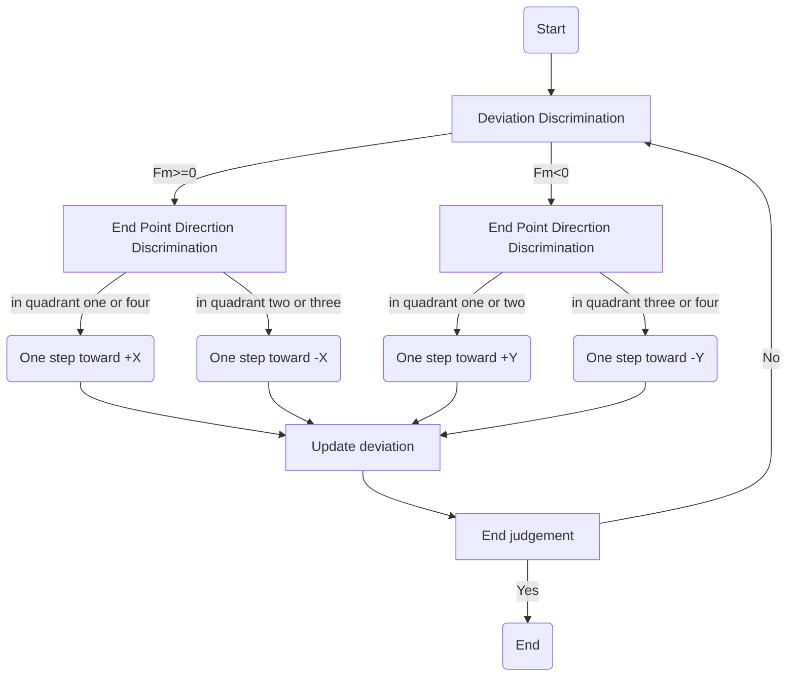

# IA_WritingRobot
&emsp;&emsp; In this project, with the help of my teacher, we used some machine parts to build four kinds of writing robot: two-axis, three-axis, four-wheel, and three-wheel. Then, I based on interpolation algorithm to devised suitable control algorithms to allow those four robots to drawing and writing some complex pictures and charcters.  

&color=rgb(45%2C219%2C207)) &emsp;&emsp; 
&emsp;&emsp; 
&color=rgb(108%2C156%2C154))

###  There have four kinks of writting robot, you can alos see the character or image the robot drawing: 
* Two-axis
  
  
* Three-axis
  
  
* Three-wheels
  
  
* Four-wheels
  
  
Although they have different mechanism structures, they all apply interpolation algorithm to control the drawing and writting behavior.
## 1. Dynamic Algorithm
&emsp;&emsp; The writing robot can be analyzed mathematically to know the relationship between the motion of the actuator and the driver. The idea of the algorithm is: first establish a plane coordinate system, we need to draw the polygonal graphic placed in the coordinate system, so that we can determine the coordinates of each vertex of the graphic, two adjacent vertices to determine a straight line between the coordinates of the points on the straight line through the interpolation calculations, and then the paintbrush in turn along these coordinates to move, complete the drawing.  
&emsp;&emsp; The writing robot realizing the trajectory movement of a straight line requires the X-axis and Y-axis to work together, but there is always a time gap between the X-axis and Y-axis in the movement, so when drawing a diagonal straight line, it actually consists of countless zigzag segments, and when these zigzag segments are infinite, these zigzag segments appear to be a straight line.  
&emsp;&emsp; In order to solve the problem of time gap, we apply the curve machining method used in CNC machining - the point-by-point-comparison interpolation algorithm: point-by-point comparison method for interpolation. Each step of the drawing pen is compared with the coordinate value on the given trajectory, and the direction of deviation is judged according to this comparison, and the direction of the next step is determined.  
&emsp;&emsp; **So in this process, we need to know how to determine the direction of deviation (deviation discrimination), and how to feed the corresponding robot platform. The conventional method is to introduce a deviation quantity Fm, and judge the feed direction by judging the value of Fm and the end point of the quadrant, when Fm≥0 and the end point is in the first and fourth quadrant, feed along the "X" direction, in the second and third quadrant, feed along the -X direction; when Fm<0 and the end point is in the first and second quadrant, feed along the "Y" direction, in the third and fourth quadrant, feed along the -Y direction. The following graph shows how the point-by-point comparison interpolation works:**

## 2. Motor Control according to the Dynamic Algorithm
&emsp;&emsp; Because the four kinds writing robot have different mechanical structure, there should design different motor control algorithms to acomplish the point-by-point-comparison interpolation algorithm. If you want to know special algorithm in special robot, you can choose the special type and see the details of how it realizes its function and point-by-point-comparison interpolation algorithm. 

|Transmission type|Specific types|
 ----  | ----  
Screw drive|Two-axis Three-axis
Wheel drive|Three-Wheels Four-Wheels

## 3. Drawing your picture or character
&emsp;&emsp; In **Three-axis, Three-Wheels and Four-Wheels**, these writing robot sopport users to draw picture and some characters they wanted with the help of **processing and inkscape.**  
&emsp;&emsp; **Processing** is a free graphical library and integrated development environment (IDE) designed to teach non-programmers the basics of computer programming in a visual environment. It uses the Java language and provides additional simplifications such as extra classes and aliases for math functions and operations.Processing also provides a graphical user interface that simplifies the compilation and execution phases. If you want to get more details about processing, you can [click here to get more informations and download](https://processing.org/).  
&emsp;&emsp; **Inkscape** is a free and open source vector graphics editing software for Windows, MacOS X and Linux system platforms. It offers a rich set of features and is widely used for artistic and technical illustrations such as cartoons, clip art, logos, typography, diagrams and flowcharts. Unlike pixel graphics, Inkscape uses vector graphics, which allows for clear printouts and rendering at unlimited scales. If you want to get more details about processing, you can [click here to get more informations and download](https://inkscape.org/).  
&emsp;&emsp; **We use Inkscape to convert the picture or characters user want into penstroke paths in .gcode format, and apply Processing to read those penstroke paths and then send relevant commands to the Arduino uno to control motors.**

